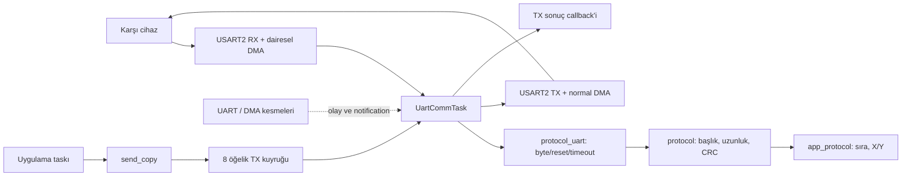

# UART: kullanım, çalışma yapısı ve sadeleştirme incelemesi

Güncelleme: 6 Ekim 2026. UART `Lib/Uart` paketine taşındı; protokol isteğe bağlı adaptörle bağlanır. Yeni projeye taşıma için [paket kullanımını](Lib/Uart/README.md) oku. Bu belge mevcut kartın uygulama ve test düzenini açıklar.

RX ve TX çekirdeği `Lib/Uart/uart_comm.c` içindedir. Uygulama yalnız `Lib/Uart/uart_comm.h` kullanır. Tek `UartCommTask`, circular RX DMA'yı ve normal TX DMA'yı yönetir; iş yokken notification ile süresiz uyur.


## Katmanlı bağlantı

`uart_comm` doğrulanmış scratch byte'larını teslim eder; parser veya paket formatını bilmez. `protocol_uart` parser context'ini taşır ve DATA/TIMEOUT/RESET olaylarını işler. `protocol` format/CRC kurallarını, `app_protocol` joystick/SEQ gibi uygulama davranışını yönetir. Hepsi tek UART taskının çağrı akışındadır.

RX callback dönüşündeki PENDING eksik aday için deadline kurar; VALIDATED gerçekten doğrulanmış mesajı bildirir. Timeout 50 ms üretici ilerlememesine bağlıdır; reset eski adayı istatistikleri koruyarak atar. `rx_timeouts` genel UART timeout olayıdır; parser istatistikleri adaptör context'indedir. Ham byte kullanımında bu bitler sıfır döner ve periyodik timeout uyanması olmaz.

Yeni projeye yalnız `Lib/Uart` kopyalanabilir. Aynı paket formatı kullanılacaksa `protocol` ve adaptör de eklenir; uygulama handler'ı yeni proje ihtiyacına göre seçilir. Mevcut kartın pin, DMA channel ve RTOS ayarları değişmedi.

## Kodu okumak için kısa yol

Uygulama yazarken dört UART fonksiyonu yeterlidir:

| Fonksiyon | Görevi | Ne zaman kullanılır? |
|---|---|---|
| `uart_comm_init()` | Handler'ları kaydeder, tek UART taskını ve TX kuyruğunu oluşturur | HAL/DMA ve RTOS kernel kurulumu sonrası, scheduler başlamadan bir kez |
| `uart_comm_send_copy()` | 1–64 baytı TX kuyruğuna kopyalar; kuyrukta yer beklemez | Scheduler çalışırken uygulama taskından veya UART handler'ından |
| `uart_comm_get_snapshot()` | Son yayımlanan durum/sayaç kopyasını verir | Durum okumak için |
| `uart_comm_request_recovery()` | RX ve/veya TX için kurtarma isteğini kaydeder | Hata sonrası uygulama kararıyla |

`uart_comm_on_uart_irq_exit(&huart2)` IRQ bağlantısına aittir; uygulama bu fonksiyonu çağırmaz. `rx_service`, `tx_service` gibi iç fonksiyonlarla ayrıca servis döngüsü kurulmaz.

Okuma sırası: `main.c` başlangıç → `uart_comm.h` uygulama arayüzü → `app_protocol.c` gelen verinin kullanımı. Yalnız sürücüyü anlamak/değiştirmek gerektiğinde `uart_comm.c` içindeki ayrıntılara geçilir.

## uart_comm.c içindeki okuma sırası

Dosya bölümleri: ortak context/tamponlar ve kritik bölüm → RX DMA/byte teslimi → RX toparlanma → TX DMA → kuyruk/sonuç/snapshot → owner task → public API → proje callback/IRQ kapıları. İç yardımcılar `rx_`, `tx_` veya `comm_` önekiyle sorumluluğunu belirtir. Test kancaları ve DWT ölçümleri koşullu test bölümlerindedir.

Ana servis turu `comm_service_once()` içinde şu sırayla çalışır:

1. RX ve TX durumlarını ilerletir; TX FAULT ise kabul kapısını kapatır.
2. `comm_deliver_pending_tx_result()` aktif gönderimin sonucunu callback'e teslim eder.
3. `comm_service_recovery_requests()` kaydedilmiş RX/TX kurtarma isteklerini işler.
4. `comm_service_tx_queue()` en fazla bir kuyruk öğesini başlatır veya iptal eder.
5. `comm_publish_snapshot()` güncel durumu yayımlar; task sonraki işi/deadline'ı hesaplayıp bekler.

Bu ayrım işlem ve kilit sırasını korur. Public API dört UART fonksiyonu olarak kalır; uygulama bu iç yardımcıları çağırmaz. Kullanılmayan eski `rx_drain()` kapısı kaldırılmıştır. Düzenleme yeni dosya veya ek UART taskı oluşturmaz; amacı akışı kolay okumaktır.

## Çalışma yapısı



**Başlangıç:** `HAL_Init` ve saat kurulumu → GPIO/DMA/USART2 kurulumu → `app_protocol_init` → `osKernelInitialize` → defaultTask ve UART taskının oluşturulması → `osKernelStart`. RX DMA, UART taskı gerçekten çalışmaya başladığında açılır; `uart_comm_init` dönüşü tek başına RX'in başlamış olduğunu göstermez.

**Alım:** DMA gelen baytları 256 baytlık halkaya yazar. IDLE, yarım/tam DMA ve hata olayları taskı uyandırır. Task mutlak üretici/tüketici sayaçlarıyla bekleyen veriyi bulur; 32 baytlık sabit kopyayı doğruladıktan sonra parser'a verir. Bir servis turu en fazla64 RX baytı tüketir; kalan iş varsa sonraki tur devam eder. Parser başlık/uzunluk/CRC uygunsa uygulama handler'ını çağırır.

**Gönderim:** Uygulamanın baytları kopyalı FIFO'ya girer. UART taskı ilk uygun öğeyi alır ve DMA'yı başlatır. DMA/kesme ilerlemesi sürerken task bekleyebilir. Sonuç oluşunca `tag` ve sonuç koduyla callback çağrılır; sonra sıradaki öğeye geçilir. FIFO sırası başarılı kuyruğa giriş sırasıdır; farklı taskların API'ye ilk giriş sırası değildir.

**Uyuma:** İş ve aktif son tarih yoksa task süresiz bekler. Yarım çerçeve, aktif TX veya toparlanma varsa ilgili son tarihe kadar bekler. Kuyruk doluluğu tek başına sürekli servis döngüsü oluşturmaz. USART/DMA kesme yolları HAL işlemlerini ilerletir ve olay kaydeder; parser ve uygulama handler'ı task bağlamında çalışır.

| Temel sınır | Mevcut değer | Neden var? |
|---|---|---|
| RX halka / geçici kopya | 256 /32 bayt | DMA yazarken parser'ın değişen belleği okumasını önler |
| RX tur bütçesi | 64 bayt | RX yükünün TX hizmetini sürekli ertelemesini önler |
| TX kapasitesi | 8 bekleyen +1 aktif, öğe başına64 bayt | Bellek ve biriken işi sınırlar |
| Yarım çerçeve timeout | 50ms üretici ilerlememesi | Eksik çerçevenin parser'ı kilitlemesini önler |
| TX / abort süresi | 20ms /20ms | Kayıp tamamlanma olayında süresiz beklemeyi önler |
| RX toparlanması | En fazla5 start /100ms; gerektiğinde son20ms stop | Sürekli hatada sınırsız yeniden başlatmayı önler |

`RUNNING` RX'in çalıştığını, TX `IDLE` yeni aktarım için uygun çekirdek durumunu gösterir. `FAULT` durumu görülebilir fakat donanım hâlâ aktif olabilir; fiziksel duruş ayrıca doğrulanır. Bu kontrollerin ayrıntısı normal kullanım için bilinmek zorunda değildir.

## app_protocol ve çerçeve formatı

`app_protocol` UART/DMA'yı yönetmez. Doğrulanmış çerçeveden uygulamanın kullanacağı bilgiyi çıkarır: işlenen çerçeve sayısı, son/beklenen SEQ, sıra bozulması olayları ve joystick X/Y. İlk çerçeve sıra referansı olur; uint16 SEQ65535 sonrası0 beklenir. `seq_gap_events` kayıp paket adedi değildir.

Mevcut üretim handler'ı TYPE0x10 ve4 bayt payload'dan iki int16 X/Y değeri çıkarır. Diğer geçerli tipler de aynı çerçeve/sıra takibine katılır; her mesaj tipi için ayrı SEQ sayacı tutulmaz. Motor/çıkış komutu veya otomatik yanıt uygulanmaz. X/Y, son geçerli joystick değerleri olarak kalır. Başka tasklar global alanları doğrudan okumak yerine `app_protocol_get_snapshot()` kullanır. Bu modül ayrı task oluşturmaz.

```text
AA 55 | VERSION | TYPE | LENGTH | SEQ(2) | PAYLOAD | CRC16(2)
```

VERSION1; LENGTH yalnız payload boyutu; payload en fazla55, çerçeve en fazla64 bayt. SEQ, CRC ve joystick int16 alanları little-endian'dır. CRC, VERSION'dan payload sonuna kadar CCITT-FALSE (poly0x1021, init0xFFFF, reflect yok, xorout0) ile hesaplanır. `frame_build_*` bu bayt düzenini hazırlar; `send_copy` kendi başına çerçeve/CRC eklemez.

## Başlatma

`main.c` bunu HAL çevrebirimleri ve RTOS kernel kurulumundan sonra, scheduler başlamadan yapıyor:

Bu kurulum mevcut projede zaten vardır. `app_protocol_init()` USER CODE2, `uart_comm_init()` USER CODE RTOS_THREADS içinde çağrılır; ikinci UART taskı veya ikinci init eklenmez. Örnek aynı bağlantının nasıl kurulduğunu gösterir.

Include'lar USER CODE Includes, dosya düzeyindeki callback ve handler tanımı USER CODE0 alanına aittir:

```c
#include "uart_comm.h"
#include "app_protocol.h"
#include "protocol_uart.h"
#include <stddef.h>

static void tx_result(const uart_comm_tx_result_t *result, void *user)
{
    /* result->tag: gönderirken verdiğin kimlik.
       result->code: COMPLETE / START_BUSY / START_ERROR /
                     DMA_ERROR / TIMEOUT / CANCELLED_FAULT.
       Uzun işi kendi uygulama taskına değer kopyasıyla aktar. */
    (void)result;
    (void)user;
}

static protocol_uart_t protocol;
static const uart_comm_handlers_t handlers = {
    .on_rx = protocol_uart_on_rx,
    .rx_user = &protocol,
    .on_tx_result = tx_result,
    .user = NULL
};
```

Bağlantı çağrısı `main()` içindeki USER CODE RTOS_THREADS alanına aittir:

```c
protocol_uart_init(&protocol, app_protocol_on_frame, NULL);
if (uart_comm_init(&huart2, &handlers) != HAL_OK) Error_Handler();
```

Uygulama ayrıca UART taskı oluşturmaz, RX/TX servis döngüsü yazmaz. RX DMA, haberleşme taskı başladığında açılır. Handler içindeki `user` hedefi modül ömrü boyunca geçerli olmalıdır. NULL handler alanı teslimi bilinçli olarak devre dışı bırakır.

## Herhangi bir uygulama taskından gönderme

Örnek bir gönderimi gösterir. `sequence` protokol sıra numarası, `tag` yerel sonuç takibi kimliğidir; aynı kavram değildir. Gerçek uygulamada bunları gönderen task yönetir, ortak sayaç kullanılıyorsa erişimi korunur.

```c
uint16_t sequence = 42U;
uint32_t tag = 1U;
uint8_t frame[FRAME_MAX_SIZE];
uint8_t len = frame_build_joystick(frame, sizeof(frame), 120, -30, sequence);
uart_comm_send_status_t status = uart_comm_send_copy(frame, len, tag);

if (status == UART_COMM_ACCEPTED) {
    /* Kaynak frame şimdi yeniden kullanılabilir; sonucu handler bildirir. */
} else if (status == UART_COMM_QUEUE_FULL) {
    /* Uygulamanın düşürme/erteleyerek yeniden kabul deneme politikası. */
} else {
    /* INVALID: bağlam/veri/boyut; NOT_READY: init/scheduler/FAULT kapısı. */
}
```

1–64 bayt kopyalanır; ISR'den gönderim reddedilir. Kuyruk 8 bekleyen öğe + 1 aktif öğe taşır. `ACCEPTED`, yerel kuyruğa kabul anlamına gelir; karşı cihazın onayı değildir. Kabul edilen her öğe bir sonuç alır. Otomatik yeniden gönderim yoktur. Sonuç API dönmeden gelebilir: tag ile ilgili uygulama kaydını çağrıdan **önce** hazırla. Başarısız kabul çağrısı sonuç callback'i üretmez.

Frame ve sonuç handler'ları UART taskında çalışır. Bekleme, `HAL_Delay`, uzun işlem ve UART HAL start/abort çağrısı yapma. Frame payload işaretçisi yalnız handler süresince geçerlidir; saklayacaksan kopyala. Handler içinden `send_copy` çağrılabilir; `QUEUE_FULL` sonucu yine kontrol edilir. Yan etkisiz komut/yanıt örneği test dosyasında bulunur; üretimde cihaz komutu etkinleştirilmez.

Mevcut üretim defaultTask'ı suspend olur; `main` içindeki sonsuz döngü de normal uygulama yürütme yeri değildir. Periyodik veri üretilecekse kendi uygulama taskında `vTaskDelayUntil` gibi RTOS beklemesi kullanılır. Handler'ın içinden periyodik döngü veya bekleme kurulmaz. Payload ve TX sonuç işaretçileri saklanmaz; uzun işlem başka taska değer kopyası/uygulama kuyruğuyla aktarılır.

`UART_COMM_TX_COMPLETE` yerel aktarım tamamlanmasıdır. Karşı cihazın mesajı uyguladığını kanıtlamak için ayrı ACK protokolü gerekir; mevcut modül bunu sağlamaz.

## Durum ve kurtarma

```c
uart_comm_snapshot_t status;
uart_comm_get_snapshot(&status);

app_proto_state_t joystick;
app_protocol_get_snapshot(&joystick);  /* X/Y/sequence tutarlı kopyası */

if (!status.tx_accepting) {
    uart_comm_request_recovery(UART_COMM_RECOVER_TX);
}
```

Kurtarma isteğinin `true` dönmesi isteğin kaydını gösterir. Sonucu sonraki snapshot ile gör: durmuş DMA, kapalı TX istekleri ve UART TC kanıtı olmadan TX kapısı açılmaz. İstek bir kez değerlendirilir; fiziksel koşullar daha sonra düzeldiyse yeni istek gerekir. RX'in sınırlı otomatik toparlanması TX'ten bağımsızdır. `FAULT` donanımın durduğu anlamına gelmez; RX için `rx_quiescent` ayrı kanıttır.

Snapshot owner'ın son yayımladığı kopyadır; API kabul sayacı bir sonraki servis yayınına kadar gecikebilir. `tx_queue_high_water` servis sırasında gözlenen en yüksek kuyruk derinliğidir. Kuyruk boş ve TX IDLE iken `accepted = completed + failed + cancelled`; aktif/bekleyen işler varken eşitlik beklenmez.

## Korunan CubeMX ayarları

STM32F407VG/168 MHz; USART2 PA2–PA3, 115200 8N1; RX DMA1 Stream5 Channel4 circular/256 bayt; TX DMA1 Stream6 Channel4 normal/64 bayt. Kullanıcının ürettiği FreeRTOS 10.3.1 ARM_CM4F/CMSIS-v2 kurulumu korunur. Modül native FreeRTOS API kullanır.

HAL tick TIM6'dan, RTOS tick SysTick'ten gelir; RTOS 1000 Hz. NVIC GROUP4; USART2 ve iki DMA IRQ önceliği 5, max syscall önceliği 5, 4 priority bit. `uart_comm_init` tek statik UART taskını priority 25 ve 512 `StackType_t` (2048 bayt) stack ile kurar; mevcut defaultTask priority 24'tür. Üretimde boş defaultTask suspend olur. Daha yüksek öncelikli uygulama yükü eklenirse RX hizmet gecikmesi yeniden ölçülmelidir; 256 bayt halka yaklaşık 22,2 ms'de dolar.

HAL callback'leri projenin `main.c` USER CODE alanında tek tanımlıdır; kütüphanenin handle alan `uart_comm_on_*` kapılarına yönlendirilir. `USART2_IRQHandler` USER CODE çıkışında `uart_comm_on_uart_irq_exit(&huart2)` çağrılır. Kullanıcı ikinci callback/servis/HAL sahibi eklememelidir. `uart_comm_internal.h` uygulama arayüzü değildir.

## Doğrulama

PC: `python tools/test_uart_rx.py`, `python tools/test_uart_tx.py`, `python tools/test_uart_comm.py`, `python tools/test_uart_port.py`. Protokolsüz USART1 ARM link/ayar kontrolü: `python tools/test_uart_portable.py` (karta yüklenmez).

Kart: `tools/build.sh test`, ardından `python tools/run_board_tests.py`; PA2–PA3 jumper'ı gerekir. Üretim: `tools/build.sh` (`UART_COMM_TEST` kapalı). Güncel CubeMX kaynak listesini almak için CubeIDE'de projeyi derle.

CubeIDE Debug yapılandırmasındaki `UART_COMM_TEST` sembolü kabul testlerini açar. IDE'den normal uygulamayı yüklemek için **Project Properties → C/C++ Build → Settings → MCU GCC Compiler → Preprocessor** altında bu sembolü kaldırıp yeniden derle. Test koşusu için tekrar eklenebilir. Son kartta bırakılan firmware bu sembol kapalı üretim derlemesidir.

Ölçüm ve kabul sonuçları [uygulama kaydında](UART_RTOS_UYGULAMA_PLANI.md). Test firmware'i DWT ile UART servisindeki çalışan süreyi ve UART/DMA ISR sürelerini ölçer; scheduler'da beklenen zamanı CPU saymaz. Bekleme hesabı/notification yönetiminin servis dışındaki maliyeti ve fixture taskının frame/CRC hazırlığı ölçüme dahil değildir. Yüzde, ölçülen servis + ISR payıdır; bütün UART taskı veya toplam sistem CPU tüketimi için kesin değer/üst sınır değildir. Daha kapsamlı task runtime ölçümü plandaki tam CPU hedefini ayrıca doğrulamalıdır.

## CH340 ile harici test

Bağlantı: CH340 TX → PA3, RX → PA2, GND → GND; UART sinyalleri 3,3 V. PA2–PA3 loopback jumper'ı çıkarılır. Doğrulanan port COM18, ayar 115200 8N1; başka bilgisayarda `--port` değiştirilir. Seri terminal aynı portu açık tutmamalıdır.

Git Bash'te `tools/build.sh serial` hem `UART_COMM_TEST` hem `UART_COMM_SERIAL_TEST` ile tam derleme yapar. Ardından:

```text
python tools/run_board_tests.py --serial --elf .build/UART_IDLE_DMAv2.elf
python tools/test_uart_serial.py --port COM18
python tools/test_uart_serial.py --port COM18 --metrics-only --output .build/board-tests/ch340-metrics.json
python tools/test_uart_serial.py --port COM18 --sink-order-probe --output .build/board-tests/ch340-order-green.json
```

İlk komut firmware'i ST-LINK ile yükler; veriler CH340 üzerinden gider. İkinci komut 11 veri/yük kontrolü, üçüncü komut aynı koşunun birikmiş IRQ/handler/stack sınırlarını doğrular. `--metrics-only` öncesinde firmware yeniden başlatılmamalıdır. Son komut kasıtlı tekrar/yanlış uzunluk gönderir ve iki sapmanın görünür sayıldığını doğrular. Toplam 13 kontrol vardır. JSON sonuçları `.build/board-tests` altında tutulur; hata veya eksik kontrol başarı sayılmaz. Bilgisayarda kurulu pyserial kullanılır.

TYPE 0x70 echo, 0x71 fixture kontrolü, 0x72 bağımsız kart TX akışı, 0x73 istatistik, 0x74 bilgisayar RX yüküdür. Bu türler yalnız test firmware'ine aittir; üretimde echo/fixture komutu bulunmaz. Callback payload'ı statik uygulama kuyruğuna kopyalar; çerçeve/CRC hazırlığı fixture taskında yapılır. Kuyruk doluluğu deneyinde yalnız fixture taskı kısa süre priority26'ya çıkar ve eski priority24'e döner; IRQ'lar açık kalır. Bu ayar üretime girmez.

Test bitince `tools/build.sh` ile test tanımları kapalı üretim derlemesi hazırlanır ve `python tools/run_board_tests.py --production --elf .build/UART_IDLE_DMAv2.elf` ile geri yüklenir. Normal CubeIDE Debug kabul koşusu hâlâ PA2–PA3 loopback gerektirir; CH340 bağlıyken yanlışlıkla o firmware yüklenmemelidir.

## Dosya düzeni

Uygulama için üç modül yeterlidir:

| Modül | Kaynak / başlık | Sorumluluk |
|---|---|---|
| UART paketi | `Lib/Uart` | RX/TX, tek owner task, kuyruk; config ve STM32F4 donanım portu |
| Protokol adaptörü | `Core/Src/protocol_uart.c`, `Core/Inc/protocol_uart.h` | Byte, reset ve timeout olaylarını parser'a bağlar |
| Protokol | `Core/Src/protocol.c`, `Core/Inc/protocol.h` | Çerçeve oluşturma, CRC ve akış ayrıştırma; HAL/RTOS bağımsız |
| Uygulama | `Core/Src/app_protocol.c`, `Core/Inc/app_protocol.h` | SEQ takibi, joystick X/Y ve tutarlı snapshot |

`protocol.c` içinde CRC, çerçeve oluşturma ve ayrıştırma olmak üzere üç bölüm vardır. Önceki `frame_build`, `frame_build_joystick`, `frame_parser_*`, `crc16_ccitt` fonksiyonlarının imzaları ve davranışı korunur. Yeni uygulama örneklerinde `protocol.h` kullanılır; eski frame/parser/CRC header'ları kaldırılmıştır.

`Lib/Uart/uart_comm_internal.h` sürücünün private tanımları ve `UART_COMM_TEST` kapılı test erişimidir. Uygulama bu başlığı kullanmaz. `app_proto_state` artık dosya içidir; uygulama ve testler durum değerlerini `app_protocol_get_snapshot()` ile okur. Snapshot mevcut kesme maskesini korur.

Kart testleri `Tests/Src` ve `Tests/Inc` içinde üç C/H çifti olarak korunur: `tests`, `uart_comm_tests`, `uart_rtos_tests`. PC model testleri `tools/tests` içindedir. Test derlemesinde `Tests/Inc` include yolu ve `Tests` kaynak klasörü CubeIDE Debug/Release yapılandırmalarına eklenmiştir. Test gövdeleri `UART_COMM_TEST` kapalıyken firmware'e girmez.

Önceki sadeleştirmede Core'daki C/H sayısı **29 → 19** oldu; proje genelinde dört kaynak dosyası azaldı. Katmanlı geçiş, UART'ın üç dosyasını Lib/Uart'a taşıdı; config/port ve isteğe bağlı adaptör eklendi. Generated platform, HAL ve FreeRTOS dosyaları korunur; `.ioc`, pinler, baud, IRQ öncelikleri ve RTOS zamanlama ayarları değişmez.

Kök klasörde üç güncel belge bulunur: bu kullanım belgesi, [birleşik mimari/yol haritası](UART_BIRLESIK_MIMARI_VE_UYGULAMA_YOL_HARITASI.md) ve [RTOS uygulama/ölçüm kaydı](UART_RTOS_UYGULAMA_PLANI.md). Beş eski belge `docs/archive` altına taşınmıştır; test/hash/karar kayıtları silinmemiştir:

- [Önceki mimari](docs/archive/MIMARI.md)
- [İlk geliştirme planı](docs/archive/UART_GELISTIRME_PLANI.md)
- [RX/TX/RTOS referans planı](docs/archive/UART_RX_TX_RTOS_YOL_HARITASI.md)
- [Önceki TX doğrulama kaydı](docs/archive/UART_UYGULAMA_DURUMU.md)
- [Önceki bulguların kapanışı](docs/archive/ACIK_BULGULAR.md)

Arşiv belgelerindeki eski API ve dosya adları tarihsel bilgidir. CubeMX yeniden kod ürettiğinde custom `Tests` ve `Lib/Uart` kaynak/include kayıtlarını koruduğunu kontrol et. Komut satırı derlemesi IDE'nin ürettiği kaynak listesini kullandığı için kaynak taşımadan sonra CubeIDE'de yeniden derleme gerekir; `Debug/subdir.mk` elle düzenlenmez.

## Sadelik için korunan sınırlar

DMA sayaçları, kopya doğrulaması, fiziksel duruş kanıtı, sınırlı toparlanma ve kabul edilen TX başına tek sonuç sözleşmesi korunur. Bu kontroller önceki hata testlerinin kapsadığı davranışlardır. `app_protocol` main içine taşınmaz; uygulama davranışı UART'dan ayrı kalır. Boş generated `freertos.c` ve defaultTask korunur; defaultTask kart testlerini başlatır. Bunların kaldırılması ayrı başlangıç/kabul çalışması gerektirir.

## Sadeleştirme uygulama planı — 6 Ekim 2026

Kullanıcının onayladığı sadeleştirme mevcut çalışma klasöründe uygulandı. Yeni bağımlılık, `.ioc` değişikliği ve UART davranış değişikliği yoktur.

- [x] Başlangıç: RX31, TX23 ve RTOS16 model kontrolü geçti.
- [x] Kart testlerinin üç C/H çiftini `Tests/Src` ve `Tests/Inc` altına taşı; CubeIDE Debug/Release kaynak ve include listelerini güncelle.
- [x] Frame/parser/CRC içeriğini `protocol.c/.h` altında birleştir; fonksiyon imzalarını, CRC parametrelerini ve ayrıştırma algoritmasını koru. Model derleme listelerini güncelle.
- [x] Eski `uart_comm_test.h` başlığını `uart_comm_internal.h` olarak adlandır; uygulama durumunu private yap ve testleri mevcut snapshot API'sine geçir.
- [x] Beş tarihsel belgeyi `docs/archive` altına taşı; Markdown bağlantılarını ve güncel dosya düzenini düzelt.
- [x] RX/TX/RTOS modellerini yeniden çalıştır. CubeIDE Debug/Release, normal test, CH340 test ve üretim firmware'lerini tam derle; test sembollerinin üretim ELF'ine girmediğini kontrol et.
- [x] Bağlı kartta CH340 veri/yük/süre kontrollerini yeniden çalıştır ve üretim firmware'ini geri yükle; sonucu bu belgede kaydet.

İnceleme odağı: eski kaynakların yanlışlıkla linklenmesi, test dosyalarının IDE kaynak listesinden düşmesi, farklı build kiplerinden nesne sızması, snapshot sırasında PRIMASK'ın korunması ve arşiv bağlantılarının bozulması. Mevcut davranış testleri yeniden kullanılır; sırf dosya taşımasını taklit eden yeni test eklenmez.

### Dosya düzeni sadeleştirmesi sonrası doğrulama

PC modelleri RX31/31, TX23/23, RTOS16/16; kart protokol birim testleri29/29 geçti. CubeIDE Debug/Release ile komut satırı normal test, CH340 test ve üretim derlemeleri hatasız ve uyarısız tamamlandı. Üretim ELF'inde test/fixture sembolleri yok; tek `UartCommTask` ve callback seti korundu. Bağımsız incelemede kritik/önemli regresyon bulunmadı; protokol fonksiyon gövdeleri ve API tanımları eski içerikle aynı.

CH340 kontrolleri13/13 geçti. 10sn boş hatta UART servis turu0; 100Hz çift yönde1000/1000 çerçeve ve ölçülen servis+ISR payı%1,476. Kritik bölüm965cycle (5,74µs), IRQ1818cycle (10,82µs), RX gecikmesi7795cycle (46,40µs); stack boş360/512word. Tam task CPU runtime hedefi bu kısmi ölçümle kapatılmaz.

Dosya düzeni sadeleştirmesi sonunda karta bırakılan firmware: `.build/board-tests/simplify-production.elf`, SHA256 `3f5f8410563ac0337fcc1f0f298c5e08673414bdc52bdcaccfb3a2d6dab1c227`; başlangıçta initialized/RX-ready/TX-accepting1 ve task sayısı4 doğrulandı. CH340 sonuç JSON'ları ve build logları `.build` altında, ayrıntılı kanıt [RTOS uygulama kaydında](UART_RTOS_UYGULAMA_PLANI.md). PA2–PA3 jumper'ı çıkarılmış olduğundan eski native loopback15/15 ve kabul71/71 koşusu bu sadeleştirme için tekrar edilmedi; geçmiş kayıt korunur.

### uart_comm okunabilirlik düzenlemesi sonrası doğrulama

6 Ekim 2026: İç yardımcılar RX/TX/ortak sorumluluğuna göre adlandırıldı, ana servis üç yardımcı adıma ayrıldı, callback/IRQ tanımları dosyanın sonunda toplandı, çok işlemli satırlar açıldı ve kullanılmayan `rx_drain` kaldırıldı. `comm_service_once`67→27 satır; toplam dosya1303→1364 satır oldu. Satır artışı bölüm başlıkları ve açık fonksiyon/satır düzeninden gelir; yeni dosya, task veya davranış eklenmedi. Public API ve kilit/işlem sırası korunur.

PC modelleri70/70, CH34013/13 geçti. CubeIDE Debug/Release ile normal test/CH340/üretim tam derlemeleri0 hata/0 uyarı; üretimde test kancaları yok ve tek UART taskı/callback seti var. Bağımsız inceleme yeni kritik/önemli regresyon bulmadı. Boş hatta10sn/0 UART turu;100Hz çift yön1000/1000 çerçevede ölçülen servis+ISR payı%1,481. Boş stack386/512word, kritik bölüm968cycle (5,76µs), IRQ1802cycle (10,73µs). Tam task runtime hedefi bu ölçümle kapatılmaz.

**Güncel kart firmware'i** `.build/board-tests/readability-production.elf`, SHA256 `bdd5f6d7f25e0b8b6d2f4b3adbbf326ed3b194b70ec6ba9500619de502c41f65`. Üretim RX/TX başlangıcı doğrulandı ve kartta bırakıldı. Güncel kanıtlar `readability-ch340-results.json`, `readability-ch340-metrics.json`, `readability-ch340-order.json`, `readability-production-smoke.log` dosyalarındadır. Commit/push yapılmadı.
