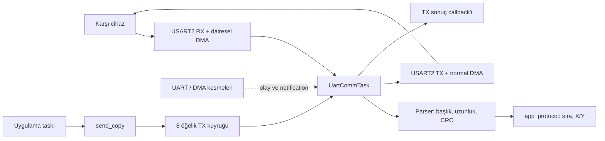

# UART: kullanım, çalışma yapısı ve sadeleştirme incelemesi

İnceleme tarihi: 6 Ekim 2026. Bu çalışma yalnız bu belgeyi günceller; kaynak kodu, dosya yerleri, proje ayarları ve kart firmware'i değiştirilmez. Sadeleştirme bölümündeki yapı öneridir; henüz uygulanmamıştır.

RX ve TX'in tamamı `Core/Src/uart_comm.c` içindedir. Uygulama yalnız `Core/Inc/uart_comm.h` kullanır. Tek `UartCommTask`, circular RX DMA'yı ve normal TX DMA'yı yönetir; iş yokken notification ile süresiz uyur.

## Kodu okumak için kısa yol

Uygulama yazarken dört UART fonksiyonu yeterlidir:

| Fonksiyon | Görevi | Ne zaman kullanılır? |
|---|---|---|
| `uart_comm_init()` | Handler'ları kaydeder, tek UART taskını ve TX kuyruğunu oluşturur | HAL/DMA ve RTOS kernel kurulumu sonrası, scheduler başlamadan bir kez |
| `uart_comm_send_copy()` | 1–64 baytı TX kuyruğuna kopyalar; kuyrukta yer beklemez | Scheduler çalışırken uygulama taskından veya UART handler'ından |
| `uart_comm_get_snapshot()` | Son yayımlanan durum/sayaç kopyasını verir | Durum okumak için |
| `uart_comm_request_recovery()` | RX ve/veya TX için kurtarma isteğini kaydeder | Hata sonrası uygulama kararıyla |

`uart_comm_on_uart_irq_exit()` IRQ bağlantısına aittir; uygulama bu fonksiyonu çağırmaz. `rx_service`, `tx_service` gibi iç fonksiyonlarla ayrıca servis döngüsü kurulmaz.

Okuma sırası: `main.c` başlangıç → `uart_comm.h` uygulama arayüzü → `app_protocol.c` gelen verinin kullanımı. Yalnız sürücüyü anlamak/değiştirmek gerektiğinde `uart_comm.c` içindeki ayrıntılara geçilir.

## Çalışma yapısı



**Başlangıç:** `HAL_Init` ve saat kurulumu → GPIO/DMA/USART2 kurulumu → `app_protocol_init` → `osKernelInitialize` → defaultTask ve UART taskının oluşturulması → `osKernelStart`. RX DMA, UART taskı gerçekten çalışmaya başladığında açılır; `uart_comm_init` dönüşü tek başına RX'in başlamış olduğunu göstermez.

**Alım:** DMA gelen baytları 256 baytlık halkaya yazar. IDLE, yarım/tam DMA ve hata olayları taskı uyandırır. Task mutlak üretici/tüketici sayaçlarıyla bekleyen veriyi bulur; 32 baytlık sabit kopyayı doğruladıktan sonra parser'a verir. Bir servis turu en fazla64 RX baytı tüketir; kalan iş varsa sonraki tur devam eder. Parser başlık/uzunluk/CRC uygunsa uygulama handler'ını çağırır.

**Gönderim:** Uygulamanın baytları kopyalı FIFO'ya girer. UART taskı ilk uygun öğeyi alır ve DMA'yı başlatır. DMA/kesme ilerlemesi sürerken task bekleyebilir. Sonuç oluşunca `tag` ve sonuç koduyla callback çağrılır; sonra sıradaki öğeye geçilir. FIFO sırası başarılı kuyruğa giriş sırasıdır; farklı taskların API'ye ilk giriş sırası değildir.

**Uyuma:** İş ve aktif son tarih yoksa task süresiz bekler. Yarım çerçeve, aktif TX veya toparlanma varsa ilgili son tarihe kadar bekler. Kuyruk doluluğu tek başına sürekli servis döngüsü oluşturmaz. USART/DMA kesme yolları HAL işlemlerini ilerletir ve olay kaydeder; parser ve uygulama handler'ı task bağlamında çalışır.

| Temel sınır | Mevcut değer | Neden var? |
|---|---|---|
| RX halka / geçici kopya | 256 /32 bayt | DMA yazarken parser'ın değişen belleği okumasını önler |
| RX tur bütçesi | 64 bayt | RX yükünün TX hizmetini sürekli ertelemesini önler |
| TX kapasitesi | 8 bekleyen +1 aktif, öğe başına64 bayt | Bellek ve biriken işi sınırlar |
| Yarım çerçeve timeout | 50ms üretici ilerlememesi | Eksik çerçevenin parser'ı kilitlemesini önler |
| TX / abort süresi | 20ms /20ms | Kayıp tamamlanma olayında süresiz beklemeyi önler |
| RX toparlanması | En fazla5 start /100ms; gerektiğinde son20ms stop | Sürekli hatada sınırsız yeniden başlatmayı önler |

`RUNNING` RX'in çalıştığını, TX `IDLE` yeni aktarım için uygun çekirdek durumunu gösterir. `FAULT` durumu görülebilir fakat donanım hâlâ aktif olabilir; fiziksel duruş ayrıca doğrulanır. Bu kontrollerin ayrıntısı normal kullanım için bilinmek zorunda değildir.

## app_protocol ve çerçeve formatı

`app_protocol` UART/DMA'yı yönetmez. Doğrulanmış çerçeveden uygulamanın kullanacağı bilgiyi çıkarır: işlenen çerçeve sayısı, son/beklenen SEQ, sıra bozulması olayları ve joystick X/Y. İlk çerçeve sıra referansı olur; uint16 SEQ65535 sonrası0 beklenir. `seq_gap_events` kayıp paket adedi değildir.

Mevcut üretim handler'ı TYPE0x10 ve4 bayt payload'dan iki int16 X/Y değeri çıkarır. Diğer geçerli tipler de aynı çerçeve/sıra takibine katılır; her mesaj tipi için ayrı SEQ sayacı tutulmaz. Motor/çıkış komutu veya otomatik yanıt uygulanmaz. X/Y, son geçerli joystick değerleri olarak kalır. Başka tasklar global alanları doğrudan okumak yerine `app_protocol_get_snapshot()` kullanır. Bu modül ayrı task oluşturmaz.

```text
AA 55 | VERSION | TYPE | LENGTH | SEQ(2) | PAYLOAD | CRC16(2)
```

VERSION1; LENGTH yalnız payload boyutu; payload en fazla55, çerçeve en fazla64 bayt. SEQ, CRC ve joystick int16 alanları little-endian'dır. CRC, VERSION'dan payload sonuna kadar CCITT-FALSE (poly0x1021, init0xFFFF, reflect yok, xorout0) ile hesaplanır. `frame_build_*` bu bayt düzenini hazırlar; `send_copy` kendi başına çerçeve/CRC eklemez.

## Başlatma

`main.c` bunu HAL çevrebirimleri ve RTOS kernel kurulumundan sonra, scheduler başlamadan yapıyor:

Bu kurulum mevcut projede zaten vardır. `app_protocol_init()` USER CODE2, `uart_comm_init()` USER CODE RTOS_THREADS içinde çağrılır; ikinci UART taskı veya ikinci init eklenmez. Örnek aynı bağlantının nasıl kurulduğunu gösterir.

Include'lar USER CODE Includes, dosya düzeyindeki callback ve handler tanımı USER CODE0 alanına aittir:

```c
#include "uart_comm.h"
#include "app_protocol.h"
#include "frame.h"
#include <stddef.h>

static void tx_result(const uart_comm_tx_result_t *result, void *user)
{
    /* result->tag: gönderirken verdiğin kimlik.
       result->code: COMPLETE / START_BUSY / START_ERROR /
                     DMA_ERROR / TIMEOUT / CANCELLED_FAULT.
       Uzun işi kendi uygulama taskına değer kopyasıyla aktar. */
    (void)result;
    (void)user;
}

static const uart_comm_handlers_t handlers = {
    .on_frame = app_protocol_on_frame,
    .on_tx_result = tx_result,
    .user = NULL
};
```

Bağlantı çağrısı `main()` içindeki USER CODE RTOS_THREADS alanına aittir:

```c
if (uart_comm_init(&huart2, &handlers) != HAL_OK) Error_Handler();
```

Uygulama ayrıca UART taskı oluşturmaz, RX/TX servis döngüsü yazmaz. RX DMA, haberleşme taskı başladığında açılır. Handler içindeki `user` hedefi modül ömrü boyunca geçerli olmalıdır. NULL handler alanı teslimi bilinçli olarak devre dışı bırakır.

## Herhangi bir uygulama taskından gönderme

Örnek bir gönderimi gösterir. `sequence` protokol sıra numarası, `tag` yerel sonuç takibi kimliğidir; aynı kavram değildir. Gerçek uygulamada bunları gönderen task yönetir, ortak sayaç kullanılıyorsa erişimi korunur.

```c
uint16_t sequence = 42U;
uint32_t tag = 1U;
uint8_t frame[FRAME_MAX_SIZE];
uint8_t len = frame_build_joystick(frame, sizeof(frame), 120, -30, sequence);
uart_comm_send_status_t status = uart_comm_send_copy(frame, len, tag);

if (status == UART_COMM_ACCEPTED) {
    /* Kaynak frame şimdi yeniden kullanılabilir; sonucu handler bildirir. */
} else if (status == UART_COMM_QUEUE_FULL) {
    /* Uygulamanın düşürme/erteleyerek yeniden kabul deneme politikası. */
} else {
    /* INVALID: bağlam/veri/boyut; NOT_READY: init/scheduler/FAULT kapısı. */
}
```

1–64 bayt kopyalanır; ISR'den gönderim reddedilir. Kuyruk 8 bekleyen öğe + 1 aktif öğe taşır. `ACCEPTED`, yerel kuyruğa kabul anlamına gelir; karşı cihazın onayı değildir. Kabul edilen her öğe bir sonuç alır. Otomatik yeniden gönderim yoktur. Sonuç API dönmeden gelebilir: tag ile ilgili uygulama kaydını çağrıdan **önce** hazırla. Başarısız kabul çağrısı sonuç callback'i üretmez.

Frame ve sonuç handler'ları UART taskında çalışır. Bekleme, `HAL_Delay`, uzun işlem ve UART HAL start/abort çağrısı yapma. Frame payload işaretçisi yalnız handler süresince geçerlidir; saklayacaksan kopyala. Handler içinden `send_copy` çağrılabilir; `QUEUE_FULL` sonucu yine kontrol edilir. Yan etkisiz komut/yanıt örneği test dosyasında bulunur; üretimde cihaz komutu etkinleştirilmez.

Mevcut üretim defaultTask'ı suspend olur; `main` içindeki sonsuz döngü de normal uygulama yürütme yeri değildir. Periyodik veri üretilecekse kendi uygulama taskında `vTaskDelayUntil` gibi RTOS beklemesi kullanılır. Handler'ın içinden periyodik döngü veya bekleme kurulmaz. Payload ve TX sonuç işaretçileri saklanmaz; uzun işlem başka taska değer kopyası/uygulama kuyruğuyla aktarılır.

`UART_COMM_TX_COMPLETE` yerel aktarım tamamlanmasıdır. Karşı cihazın mesajı uyguladığını kanıtlamak için ayrı ACK protokolü gerekir; mevcut modül bunu sağlamaz.

## Durum ve kurtarma

```c
uart_comm_snapshot_t status;
uart_comm_get_snapshot(&status);

app_proto_state_t joystick;
app_protocol_get_snapshot(&joystick);  /* X/Y/sequence tutarlı kopyası */

if (!status.tx_accepting) {
    uart_comm_request_recovery(UART_COMM_RECOVER_TX);
}
```

Kurtarma isteğinin `true` dönmesi isteğin kaydını gösterir. Sonucu sonraki snapshot ile gör: durmuş DMA, kapalı TX istekleri ve UART TC kanıtı olmadan TX kapısı açılmaz. İstek bir kez değerlendirilir; fiziksel koşullar daha sonra düzeldiyse yeni istek gerekir. RX'in sınırlı otomatik toparlanması TX'ten bağımsızdır. `FAULT` donanımın durduğu anlamına gelmez; RX için `rx_quiescent` ayrı kanıttır.

Snapshot owner'ın son yayımladığı kopyadır; API kabul sayacı bir sonraki servis yayınına kadar gecikebilir. `tx_queue_high_water` servis sırasında gözlenen en yüksek kuyruk derinliğidir. Kuyruk boş ve TX IDLE iken `accepted = completed + failed + cancelled`; aktif/bekleyen işler varken eşitlik beklenmez.

## Korunan CubeMX ayarları

STM32F407VG/168 MHz; USART2 PA2–PA3, 115200 8N1; RX DMA1 Stream5 Channel4 circular/256 bayt; TX DMA1 Stream6 Channel4 normal/64 bayt. Kullanıcının ürettiği FreeRTOS 10.3.1 ARM_CM4F/CMSIS-v2 kurulumu korunur. Modül native FreeRTOS API kullanır.

HAL tick TIM6'dan, RTOS tick SysTick'ten gelir; RTOS 1000 Hz. NVIC GROUP4; USART2 ve iki DMA IRQ önceliği 5, max syscall önceliği 5, 4 priority bit. `uart_comm_init` tek statik UART taskını priority 25 ve 512 `StackType_t` (2048 bayt) stack ile kurar; mevcut defaultTask priority 24'tür. Üretimde boş defaultTask suspend olur. Daha yüksek öncelikli uygulama yükü eklenirse RX hizmet gecikmesi yeniden ölçülmelidir; 256 bayt halka yaklaşık 22,2 ms'de dolar.

HAL callback'leri modülde tek tanımlıdır. `USART2_IRQHandler` USER CODE çıkışında `uart_comm_on_uart_irq_exit()` çağrılır. Kullanıcı ikinci callback/servis/HAL sahibi eklememelidir. `uart_comm_test.h` uygulama arayüzü değildir.

## Doğrulama

PC: `python tools/test_uart_rx.py`, `python tools/test_uart_tx.py`, `python tools/test_uart_comm.py`.

Kart: `tools/build.sh test`, ardından `python tools/run_board_tests.py`; PA2–PA3 jumper'ı gerekir. Üretim: `tools/build.sh` (`UART_COMM_TEST` kapalı). Güncel CubeMX kaynak listesini almak için CubeIDE'de projeyi derle.

CubeIDE Debug yapılandırmasındaki `UART_COMM_TEST` sembolü kabul testlerini açar. IDE'den normal uygulamayı yüklemek için **Project Properties → C/C++ Build → Settings → MCU GCC Compiler → Preprocessor** altında bu sembolü kaldırıp yeniden derle. Test koşusu için tekrar eklenebilir. Son kartta bırakılan firmware bu sembol kapalı üretim derlemesidir.

Ölçüm ve kabul sonuçları [uygulama kaydında](UART_RTOS_UYGULAMA_PLANI.md). Test firmware'i DWT ile UART servisindeki çalışan süreyi ve UART/DMA ISR sürelerini ölçer; scheduler'da beklenen zamanı CPU saymaz. Bekleme hesabı/notification yönetiminin servis dışındaki maliyeti ve fixture taskının frame/CRC hazırlığı ölçüme dahil değildir. Yüzde, ölçülen servis + ISR payıdır; bütün UART taskı veya toplam sistem CPU tüketimi için kesin değer/üst sınır değildir. Daha kapsamlı task runtime ölçümü plandaki tam CPU hedefini ayrıca doğrulamalıdır.

## CH340 ile harici test

Bağlantı: CH340 TX → PA3, RX → PA2, GND → GND; UART sinyalleri 3,3 V. PA2–PA3 loopback jumper'ı çıkarılır. Doğrulanan port COM18, ayar 115200 8N1; başka bilgisayarda `--port` değiştirilir. Seri terminal aynı portu açık tutmamalıdır.

Git Bash'te `tools/build.sh serial` hem `UART_COMM_TEST` hem `UART_COMM_SERIAL_TEST` ile tam derleme yapar. Ardından:

```text
python tools/run_board_tests.py --serial --elf .build/UART_IDLE_DMAv2.elf
python tools/test_uart_serial.py --port COM18
python tools/test_uart_serial.py --port COM18 --metrics-only --output .build/board-tests/ch340-metrics.json
python tools/test_uart_serial.py --port COM18 --sink-order-probe --output .build/board-tests/ch340-order-green.json
```

İlk komut firmware'i ST-LINK ile yükler; veriler CH340 üzerinden gider. İkinci komut 11 veri/yük kontrolü, üçüncü komut aynı koşunun birikmiş IRQ/handler/stack sınırlarını doğrular. `--metrics-only` öncesinde firmware yeniden başlatılmamalıdır. Son komut kasıtlı tekrar/yanlış uzunluk gönderir ve iki sapmanın görünür sayıldığını doğrular. Toplam 13 kontrol vardır. JSON sonuçları `.build/board-tests` altında tutulur; hata veya eksik kontrol başarı sayılmaz. Bilgisayarda kurulu pyserial kullanılır.

TYPE 0x70 echo, 0x71 fixture kontrolü, 0x72 bağımsız kart TX akışı, 0x73 istatistik, 0x74 bilgisayar RX yüküdür. Bu türler yalnız test firmware'ine aittir; üretimde echo/fixture komutu bulunmaz. Callback payload'ı statik uygulama kuyruğuna kopyalar; çerçeve/CRC hazırlığı fixture taskında yapılır. Kuyruk doluluğu deneyinde yalnız fixture taskı kısa süre priority26'ya çıkar ve eski priority24'e döner; IRQ'lar açık kalır. Bu ayar üretime girmez.

Test bitince `tools/build.sh` ile test tanımları kapalı üretim derlemesi hazırlanır ve `python tools/run_board_tests.py --production --elf .build/UART_IDLE_DMAv2.elf` ile geri yüklenir. Normal CubeIDE Debug kabul koşusu hâlâ PA2–PA3 loopback gerektirir; CH340 bağlıyken yanlışlıkla o firmware yüklenmemelidir.

## Dosyalar: hangisi ne için var?

İnceleme anında `Core/Src` içinde16 `.c`, `Core/Inc` içinde13 `.h`, toplam29 dosya vardır. Drivers, Middlewares ve startup dosyaları bu sayıya dahil değildir.

| Grup | Dosyalar | Rolü |
|---|---|---|
| UART taşıma | `uart_comm.c/.h` | Tek owner task, RX/TX DMA, FIFO, hata/kurtarma, public API |
| Protokol oluşturma | `frame.c/.h` | Başlık, payload ve CRC ile gönderilecek baytları kurar |
| Protokol ayrıştırma | `parser.c/.h` | Bayt akışını doğrulanmış çerçevelere dönüştürür |
| Ortak CRC | `crc16.c/.h` | Frame ve parser'ın kullandığı aynı CRC hesabı |
| Uygulama davranışı | `app_protocol.c/.h` | Joystick ve uygulama SEQ durumu |
| İç sürücü/test bağlantısı | `uart_comm_test.h` | İç RX/TX türleri, sabitler, prototipler ve test erişimi |
| Kart testleri | `tests.c/.h`, `uart_comm_tests.c/.h`, `uart_rtos_tests.c/.h` | Birim, çekirdek, RTOS ve CH340 kabul testleri |
| CubeMX/platform | `main.c/.h`, `stm32f4xx_it.c/.h`, `stm32f4xx_hal_msp.c`, `stm32f4xx_hal_timebase_tim.c`, `stm32f4xx_hal_conf.h`, `FreeRTOSConfig.h`, `system_stm32f4xx.c`, `syscalls.c`, `sysmem.c`, `freertos.c` | Donanım, kesme, RTOS ve çalışma ortamı bağlantıları |

Özel üretim C kaynakları toplam1810 satır: UART1303, parser252, uygulama110, frame99, CRC46. Üç kart test kaynağı toplam3949 satırdır. Sayılara yorumlar ve boş satırlar dahildir; bu bir firmware boyutu ölçümü değildir. Üretim derlemesinde test gövdeleri `UART_COMM_TEST` ile dışarıda kalır. Karmaşanın önemli kısmı, test ve üretim dosyalarının aynı klasörde görünmesidir.

`uart_comm_test.h` adına rağmen yalnız test dosyası değildir: `uart_comm.c` bunu üretimde de içerir. İç türler/sabitler buradan geldiği için doğrudan silinemez. `freertos.c` şu anda yalnız include ve boş USER CODE alanlarından oluşur; task kurulumları `main.c`/`uart_comm.c` içindedir.

## Sadeleştirme önerisi — uygulanmadı

Önerim: **UART taşıma, protokol ve uygulama olmak üzere üç anlaşılır modül bırakmak.** Testler ayrı klasörde görünür. Yeni sınıf, genel plugin sistemi, dinamik dispatch veya ikinci UART sahibi eklemeye ihtiyaç yoktur.

### 1. Testleri ayrı klasöre taşı

`tests`, `uart_comm_tests`, `uart_rtos_tests` C/H çiftleri `Tests/Src` ve `Tests/Inc` altında toplanabilir. Altı dosya korunur; test kanıtı kaybedilmez. `uart_comm_test.h` iç sürücü tanımlarını da taşıdığı için ilk aşamada yerinde kalır.

Bu adım toplam dosya sayısını azaltmaz; Core görünümünü29'dan23 dosyaya indirir. CubeIDE kaynak/include yolları ve Python derleme listeleri güncellenmelidir. Debug tarafından üretilen `subdir.mk` kalıcı çözüm olarak elle düzenlenmez. Test .c dosyalarını tek4000 satırlık dosyada toplamak dosya sayısını azaltır ama okunabilirliği kötüleştirir; önerim bu değildir.

### 2. Frame, parser ve CRC'yi tek protokol modülünde birleştir

`frame.c/.h`, `parser.c/.h`, `crc16.c/.h` birlikte `protocol.c/.h` olabilir: altı dosya yerine iki dosya, **toplam dört dosya azalması**. Bunlar aynı bayt formatını paylaşır; saf C ve HAL/RTOS bağımsız kalabilirler. Yeni dosya yaklaşık400 satır C içeriği taşır; içeride CRC, frame oluşturma ve parser olarak üç kısa bölüm yeterlidir.

Mevcut `frame_build`, `frame_build_joystick`, `frame_parser_*` davranışı ve payload ömrü korunur. UART header'ındaki `parser.h` bağımlılığı ve uygulama/test include'ları yeni `protocol.h` için güncellenir. CRC birim testlerinin erişimi korunmadan eski header silinmez. Kodun algoritmaları sırf dosya birleşti diye kısaltılmak zorunda değildir.

İlk iki adım birlikte: Core29→19 dosya; proje genelinde gerçek azalma4 dosyadır. Production'a özel beş C/H çifti, üç C/H çiftine iner: `uart_comm`, `protocol`, `app_protocol`. Generated platform dosyaları ayrı kalır.

### 3. İç sürücü arayüzünü anlaşılır hale getir

`uart_comm_test.h` içindeki üretime gereken tanımların private rolü daha açık adlandırılabilir veya C dosyasına alınabilir. Teste açılan fonksiyonlar ayrı test bölümünde kalır. Yeniden adlandırma tek başına dosya sayısını azaltmaz; amaç uygulama geliştiricisinin bu199 satırlık iç arayüzü kullanmak zorunda sanmamasıdır.

`app_proto_state` gibi doğrudan erişilebilir globals yerine snapshot tek okuma yolu olabilir. Testlerin mevcut erişimleri uyarlanmalıdır. `app_protocol.h` içindeki eski `uart_rx.c`/"M1'de taşınacak" anlatımı da artık tarihsel bilgidir; güncel sorumluluk açıklamasıyla kısaltılabilir. Bu, davranış değişikliği gerektirmeyen bir okunabilirlik iyileştirmesidir.

### 4. Diğer dosya azaltma seçenekleri

| Seçenek | Kazanç | Değerlendirme |
|---|---|---|
| Boş `freertos.c`'yi kaldırmak | 1 dosya | Şu an fonksiyon tanımlamıyor; fakat CubeMX üretebilir. Proje kaynak listesi ve yeniden üretim süreci kontrol edilmeden silinmez. Öncelikli kazanç değildir. |
| `app_protocol.c/.h` işini main USER CODE'a taşımak | 2 dosya | Yalnız sabit joystick uygulaması için mümkün; main'i büyütür ve başka taskların uygulama arayüzünü zorlaştırır. Ayrı iki küçük dosyayı korumak daha anlaşılır. |
| Tüm özel üretim kodunu `uart_comm.c/.h` içine koymak | 8 dosya | Özel10 dosya2 olur; C dosyası yaklaşık1810 satıra çıkar, uygulama ve protokol UART'a bağlanır. Dosya sayısı azalır ama karmaşa artar. Önerilmiyor. |
| Eski beş MD belgesini arşiv klasörüne taşımak | Kök görünümü8→3 MD | Toplam dosya sayısı değişmez; hangi belgenin güncel olduğu netleşir. Bağlantılar güncellenir, eski test kanıtı korunur. |
| Beş geçmiş MD'yi tek tarihçe belgesinde birleştirmek | 4 belge dosyası | Gerçek azalma sağlar; karar/test/hash kayıtları çıkarılmadan ve tarihleri korunarak yapılabilir. Uzun tarihçe normal kullanım belgesine eklenmez. |

Kök klasörde güncel üç belge: bu kullanım/inceleme belgesi, `UART_BIRLESIK_MIMARI_VE_UYGULAMA_YOL_HARITASI.md` şartnamesi, `UART_RTOS_UYGULAMA_PLANI.md` sonuç kaydı. Arşiv adayları: `MIMARI.md`, `UART_GELISTIRME_PLANI.md`, `UART_RX_TX_RTOS_YOL_HARITASI.md`, `UART_UYGULAMA_DURUMU.md`, `ACIK_BULGULAR.md`. Bunların eski anlatımı güncel API yerine kullanılmaz.

### 5. Satır sayısı için kaldırılmaması gerekenler

DMA üretici/tüketici sayaçları, kopya öncesi/sonrası doğrulama, hata nesli, fiziksel duruş kanıtı, toparlanma bütçesi, FAULT kabul kapısı ve kabul edilen öğe başına tek sonuç sözleşmesi gereksiz katmanlar değildir. Önceki hata testlerinin koruduğu işlevlerdir. Modulo konumla RX sayımı, sınırsız retry veya task içinde bloklayan HAL gönderimiyle değiştirilmeleri önerilmez.

İç HAL TX sonucu ile public kuyruk kabul sonucunun farklı olması da anlamlıdır: yerel kuyruğa kabul ile DMA başlatma/tamamlama farklı aşamalardır. Sırf enum sayısını azaltmak için bunlar birbirine karıştırılmaz. Snapshot yayınındaki açık alan kopyaları okunabilir; kısa görünmesi için çok katmanlı makro sistemi eklemek uygun değildir.

Boş defaultTask, timer taskı veya CMSIS katmanı daha sonra ayrıca değerlendirilebilir. Bunlar dosya taşıma değildir; kernel başlangıcı, statik bellek hook'ları ve test taskı başlatma akışını etkiler. Özellikle defaultTask kart testlerini başlattığından doğrudan kaldırılması testlerin hiç çalışmamasına yol açabilir. HAL/FreeRTOS/Drivers dosyaları da include/build/config ilişkileri incelenmeden "fazlalık" diye silinmez.

## Önerilen ilerleme

Önce testleri ve eski belgeleri görünümde ayır; sonra yalnız protokol C/H çiftlerini birleştir. `app_protocol` ve tek `uart_comm` sahibi korunur. Generated kod, `.ioc`, pinler ve peripheral ayarları bu düzenleme için değişmek zorunda değildir. Uygulama eklemesi USER CODE alanlarına yapılır.

İleride uygulanırsa PC RX/TX/RTOS modelleri, normal test/üretim tam derlemeleri, CH340 veri/yük/süre testleri ve üretimde test sembollerinin olmaması yeniden doğrulanır. Test taşıma yolları ve ADC gibi ilgisiz peripheral ayarları aynı değişikliğe karıştırılmaz. Bu belgede öneriler hazırlanmıştır; hiçbir kaynak dosya birleştirilmemiş, taşınmamış veya silinmemiştir.
